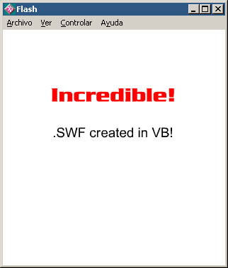

<div align="center">

## SWF Generator


</div>

### Description

Hello all, This demo shows you how to create Flash movies and add text and images in a WYSIWYG enviroment. the SWF Generator project uses Bukoo, a powerful COM object that allows you to create ShockWave Files.

There are a few bugs as this project is not yet 100% finished. Most of it is commented but if you need any help contact me.

PS:In order for this demo to work you must download the Bukoo free dll (86k) http://bukoo.sourceforge.net/swfobjs_2.zip and register it to your system.

Hope this helps. please vote!

Thanks Matt!!
 
### More Info
 


<span>             |<span>
---                |---
**Submitted On**   |2002-03-02 01:21:18
**By**             |[Matthew Woodhams](https://github.com/Planet-Source-Code/PSCIndex/blob/master/ByAuthor/matthew-woodhams.md)
**Level**          |Intermediate
**User Rating**    |4.4 (62 globes from 14 users)
**Compatibility**  |VB 5\.0, VB 6\.0
**Category**       |[OLE/ COM/ DCOM/ Active\-X](https://github.com/Planet-Source-Code/PSCIndex/blob/master/ByCategory/ole-com-dcom-active-x__1-29.md)
**World**          |[Visual Basic](https://github.com/Planet-Source-Code/PSCIndex/blob/master/ByWorld/visual-basic.md)
**Archive File**   |[SWF\_Genera58734312002\.zip](https://github.com/Planet-Source-Code/matthew-woodhams-swf-generator__1-32249/archive/master.zip)

### API Declarations

```
SetWindowPos,
GetCursorPos,
GetPrivateProfileString,
WritePrivateProfileString...
```


